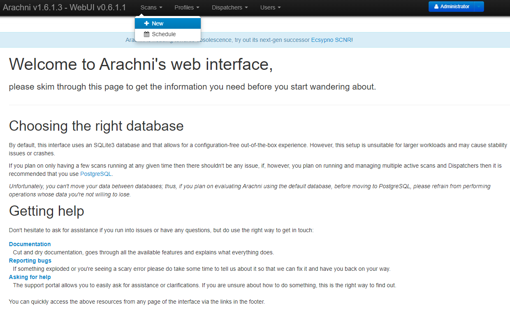

### TL;DR
오늘은 저희 회사의 보안 솔루션에 웹 취약점이 발견되어 고쳐보았습니다.

### 설치

진단은 무료 오픈소스 웹 취약점 스캐너인 **arachni**를 사용하였습니다. 참고로 현재(2022.10월) arachni 홈페이지를 방문해보면 "obsolescence"(노후화)되어가고 있다며 후계자인 **Ecsypno SCNR**를 사용해보라는 문구가 나오네요.

arachni를 사용하는 방법은 먼저 홈페이지에서 OS별 패키지를 다운받아 설치해야 합니다. 다만 제가 사용해본 바, 되도록이면 Linux 환경에서 설치하고 사용하는 것이 수월합니다. 특히 Windows PC라면 WSL2를 이용해서 리눅스 환경을 갖춘 후 설치하는 것이 쉽습니다.

저는 Windows PC의 WSL2 - Ubuntu 환경에서 진행했습니다.

```sh
$ wget https://github.com/Arachni/arachni/releases/download/v1.6.1.3/arachni-1.6.1.3-0.6.1.1-linux-x86_64.tar.gz
```
`wget`을 통해 `tar.gz`파일을 다운 받습니다. (홈페이지에서 클릭한 것과 동일)

```sh
$ tar -zxvf arachni-1.6.1.3-0.6.1.1-linux-x86_64.tar.gz
```
`tar` 명령어를 통해 타르볼 압축을 풀어줍니다.

```sh
$ ./arachni-1.6.1.3-0.6.1.1/bin/arachni_web
```
압축이 풀린 경로에 `/bin/arachni_web`을 실행시켜줍니다.

이렇게 실행하면 arachni의 Web 인터페이스가 동작하고 아래와 같은 출력이 나옵니다.
```sh
Puma starting in single mode...
* Puma version: 5.6.4 (ruby 2.7.5-p203) ("Birdie's Version")
*  Min threads: 0
*  Max threads: 5
*  Environment: development
*          PID: 899
* Listening on http://127.0.0.1:9292
* Listening on http://[::1]:9292
Use Ctrl-C to stop
```
이제 위의 URL로 접속해보면 로그인 페이지가 나옵니다.

> 

**초기 계정은 `README`에 적혀있으니 확인합니다.** 초기 계정으로 접속하면 대시보드 화면이 나오고 상단바에 "Scans"라는 메뉴가 가장 첫번째로 보일 것입니다.

> 

`+ New`를 눌러서 새로운 스캔을 시작합니다.

> 

검사는 기본값으로 진행하였습니다. "Target URL"이라고 적힌 부분에 검사할 웹사이트 주소를 적어주시면 됩니다. 그리고 하단의 "Go!"를 누르면 바로 검사가 진행됩니다.

### 검사 결과

아래와 같이 검사결과가 나왔으며, `Informational`을 제외하고 `Medium`과 `Low` 레벨 취약점이 각 1개씩 총 2개가 발견되어 처리해보았습니다.

> 

두 개의 취약점 모두 어떤 특정 헤더가 존재하지 않는다는 뜻이었습니다. 인터넷에 검색을 해보니, `Strict-Transport-Security` 헤더는 클라이언트(브라우저)에게 `https://`를 강제하는 헤더이고, 이것 없이 그냥 http를 `301` 응답으로 https로 리다이렉트 시키는 것은 여전히 `man-in-the-middle` 공격에 취약하기 때문에 반드시 설정해야한다고 합니다.

또 다른 취약점은 `X-Frame-Options` 헤더가 존재하지 않는다는 뜻으로, 이는 웹사이트가 `<iframe>`안에 표시되어도 괜찮은 지를 결정한다고 합니다. 웹사이트가 iframe에 표시되는 경우에는 다른 악성 웹사이트에서 우리 사이트의 내용을 포함할 수 있게 되기에 `Clickjacking` 공격에 취약해진다고 합니다.

### 해결

두 취약점 모두 헤더만 설정해주면 되는 문제였기에, Nginx의 `.conf`파일에 해당 헤더를 포함하도록 설정해주어 간단히 해결되었습니다.

```sh
# /etc/nginx/nginx.conf

http {
    # ...생략
    add_header X-Frame-Options DENY;
    add_header Strict-Transport-Security "max-age=63072000; includeSubdomains; preload";
}
```

이렇게 하고 Nginx를 restart한 다음 다시 취약점 점검을 돌려보았습니다.

> 

이렇게 취약점이 사라진 것을 볼 수 있습니다!

오늘은 웹 취약점을 점검하는 법과 해결한 사례에 대해 적어보았습니다. 프론트엔드 개발자로 일을 하며 이러한 서버쪽 취약점에 대해서는 알아볼 기회가 없었는데 이번 기회에 직접 검색을 통해 해결해 나아가면서 좋은 경험이 되었던 것 같습니다. 앞으로는 lighthouse 점수만 신경 쓸 것이 아니라 이러한 취약점에도 신경쓰며 배포하는 개발자가 되면 좋겠습니다.
