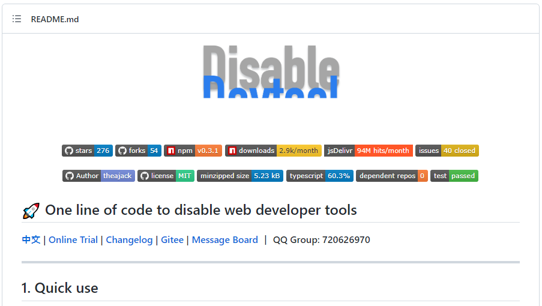

오늘도 보안기능확인서 신청을 위해 들어온 요구사항 중 하나를 해결하고 기록하였습니다.

원래의 요구사항은 사용자의 비밀번호가 어디에도 평문으로 남아서는 안된다는 지적이었으며, 구체적으로는 프론트엔드에서 로그인을 할 때 개발자도구를 열면 사용자가 입력한 암호가 보인다는 것이었습니다.

비밀번호를 해싱해서 보내는 해결방법도 있었지만, 개발자도구 특성상 어디에 언제 무엇이 발견될지 모르는터라 시한폭탄과도 같다고 판단하여 아예 접근을 차단해달라는 요청을 받았습니다.

## 레퍼런스 확인

우선 개발자도구 차단이 가능한지 레퍼런스를 찾아보았습니다. 저희 이사님(개발팀장/백엔드)께서는 신한카드 홈페이지를 예로 드시면서 여기 홈페이지는 개발자도구가 안열린다고 이렇게 해달라고 하셨습니다. **하지만 제가 확인해보니 개발자 도구를 여는 단축키(F12, Ctrl+Shift+I)를 막은 것이지 개발자도구를 막은 것이 아니라서, 브라우저 메뉴를 클릭해 개발자 도구를 열면 그냥 열려버렸습니다.**

> 

이 외에 어떤 사이트를 찾아봐도 개발자 도구를 완벽히 막는 사이트는 없어보였습니다. 레퍼런스 찾기는 둘째치고, 생각을 조금 해보면 프론트엔드 개발자가 통제할 수 있는 것은 Web API 외에는 없기 때문에 API 목록을 확인해보았으나 따로 개발자도구 관련 API는 공개된 것이 없었습니다. 즉, 프론트엔드 스크립트로 브라우저 개발자 도구에 직접적으로 관여하는 것은 **불가능**해보였습니다.

> 

[MDN의 Web API 목록](https://developer.mozilla.org/en-US/docs/Web/API)

## 관련 npm 패키지

그래도 없는게 없다는 npm에 혹시 관련 라이브러리가 있을까 싶어 찾아보니 아래와 같은 패키지가 있었습니다.

> 

https://github.com/theajack/disable-devtool

해당 도구의 설명을 보면 스크립트 태크를 이용해서 간단하게 삽입할 수 있고, 개발자도구 단축키를 막아주며, 브라우저 메뉴바에 직접 클릭을 통해 열면 바로 창이 닫히도록 개발해놓았다고 합니다.

간단하게 html을 만들어서 `<script>` 태그로 삽입해보았고 아래와 같이 브라우저 메뉴를 통해 개발자도구를 열면 순식간에 창이 닫혀버리는 것을 볼 수 있었습니다.

> 

## 분석 및 결론

우선 Web API 중에는 개발자 도구 관련 API가 없으므로 공식적으로 개발자 도구를 차단하는 방법은 없습니다.

하지만 관련 npm 패키지들이 구현한 방식을 보면, 윈도우 사이즈나 디버거 등을 이용해서 우회적으로 개발자 도구가 열린 것을 감지해내는 것 같습니다. 이로 인해 개발자 도구가 열리는 것을 막을 수는 없지만 열리는 것을 감지해서 창을 닫아버린다던지 하는 조치를 취할 수는 있었습니다.

이가 없으면 잇몸으로 한다는 말이 와닿는 사례였습니다.