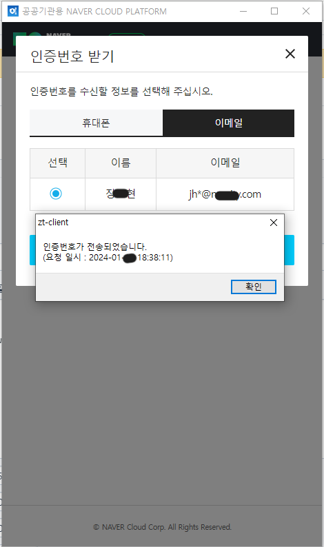
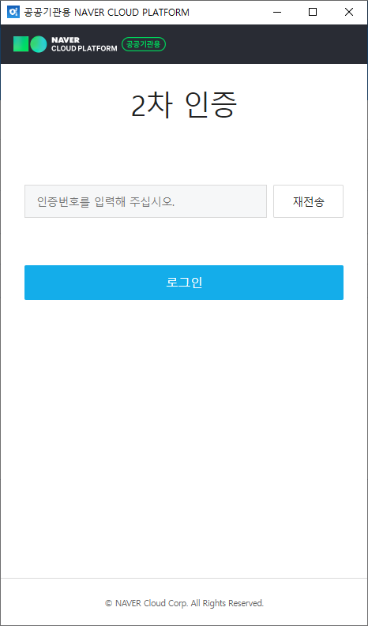

`window.alert`는 웹페이지에서 얼럿을 발생시킬 때 종종 사용하는 내장 함수입니다. 다만 이 함수는 Main Thread를 Block하기 때문에, 얼럿이 떠있는 동안 뒤의 UI가 멈추는 것이 기본 스펙입니다.

Electron에서는 이 동작이 예기치 못한 오류를 일으켜서, alert이 종료된 이후에도 `<input>` 칸에 커서(focus)가 생기지 않아 입력이 되지 않는 문제가 있습니다.

### 실제 오류 케이스

저희 솔루션에는 N사의 SSO를 이용해서 인증을 하는 단계가 있습니다. 이때, 2차 인증을 하게 되면 인증번호를 지정된 휴대폰 번호나 email로 발송하게 되고 몇시 몇분에 발송되었다는 alert이 뜨게 됩니다.

그런데 이 때 뜨는 alert를 확인을 눌러 닫고 나면, 그 뒤에 인증번호를 입력하는 칸에 포커스가 잡히지 않아 커서가 생기질 않습니다.

|            인증번호 발송 직후            |            input칸 입력 안됨             |
| :--------------------------------------: | :--------------------------------------: |
|  |  |

본문 초두에 요약해드렸듯이, 원인은 Electron과 window.alert 간의 충돌로 보입니다. 관련하여 StackOverflow와 Github Issue 글을 찾을 수 있었습니다.

- https://stackoverflow.com/questions/56805920/cant-edit-input-text-field-after-window-alert
- https://github.com/electron/electron/issues/19977

Github Issue쪽을 보면 최초 발견 시점이 2019년도의 `electron@5.0.10` 버전인데, 불과 2주전인 `28.1.1` 버전까지도 증상이 지속되고 있는 것으로 보아, 개선이 불가한듯 합니다.

프레임워크의 내부 소스 수준에서 개선이 어렵다면 다른 Workaround를 찾아야할 것 같습니다.

### 임시 해결 방안

일단 `alert`을 사용하지 않으면 해결되는 문제이지만, N사의 SSO 페이지는 제가 관리하는 부분이 아니기 때문에 alert 대신 다른 함수를 쓰도록 변경할 수 없습니다.

그 대신, 해당 윈도우의 `alert` 함수를 덮어써버리는 방식으로 해결해보았습니다. (메소드 오버라이딩)

개발자 콘솔을 열어서 아래와 같이 덮어쓰면 얼럿이 뜨지 않게 됩니다.

```js
window.alert = (msg) => return;
// 혹은
window.alert = (msg) => {
    // 원하는대로 `msg`를 다른 방식으로 표현
    // 예를 들어,
    console.log(msg);
    return;
}
```

문제는 이 스크립트를 어떻게 실행시키느냐였습니다. 사용자에게 로그인 할 때마다 일일이 개발자도구를 열어서 타이핑하라고 할 순 없으니까요.

SSO 로그인 페이지는 Electron의 `BrowserWindow` 클래스를 통해 생성되고 있습니다. 이 `BrowserWindow` API 문서를 보면 뭔가 방법이 있을 것 같았고, 역시나 유용해보이는 메소드가 있었습니다.

- https://www.electronjs.org/docs/latest/api/web-contents#contentsexecutejavascriptcode-usergesture

해당 메소드를 이용하면 특정 `BrowserWindow`에 Javascript를 실행시킬 수 있습니다. 이걸 이용해서 위의 `window.alert`를 덮어쓰는 코드를 실행시키면 얼럿이 뜨는 것을 방지할 수 있습니다.

```js
const win = new BrowserWindow()

win.webContents.executeJavaScript('window.alert = (msg) => return;')
```

참고로, 실행한 js의 결과값/에러값은 Promise 형태로 받아볼 수 있습니다. 위 예시처럼 굳이 받을 것이 없어도, 에러가 일어날 수 있기 때문에 `catch`절은 추가해주는 것이 좋습니다.

만일 에러가 일어날 경우 에러객체가 Main 프로세스로 넘어오는데 이 때 Object를 Clone할 수 없다는 에러가 또 발생하기 때문입니다. (이는 에러 객체의 `Symbol`을 marshalling 할 수 없기 때문인데, 추후 별도의 포스트로 기회가 된다면 다루어 보겠습니다)

따라서 최종적으로는 아래와 같이 해주었습니다.

```js
win.webContents
  .executeJavaScript('window.alert = (msg) => return;')
  .catch(err => console.error(err.message))
```

다만 이렇게 하면 `alert`이 무시되기 때문에, 사용자에게 필요한 정보가 누락될 수 있습니다. 가능하면 그냥 `return`하는 것이 아니라 다른 방법으로 해당 메시지를 표시해주는 것이 좋습니다. 어떤 UI로 대체할 것인가부터는 본 글의 요지에서 벗어나기 때문에 여기까지 하겠습니다.
