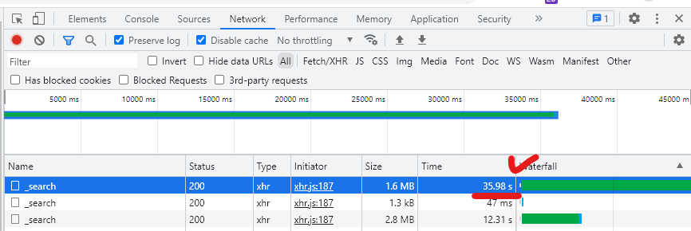

저희 회사의 IDS 솔루션은 탐지로그를 엘라스틱 서치에 저장하고 있습니다.

그리고 프론트엔드에서 직접 DSL 쿼리를 통해 가져와 보여주고 있습니다.

최근 고객사로부터 로그량이 많은 경우 페이지 로딩이 지나치게 길다는 불편사항을 접수 받았습니다. 확인해보니 특정 기간동안 로그량이 1억 7천만건이나 되었고 `size` 쿼리문을 통해 1000건만 가져오도록 했음에도 거의 30~40초 가량의 시간이 걸리는 것을 확인했습니다.

> 

해당 페이지의 개발자도구-네트워크 탭을 살펴보면 총 3개의 쿼리를 날리고 있는데, 이 중에 가장 오래걸린 쿼리가 바로 실제 데이터(로그)를 가져오는 쿼리입니다. 나머지 2개는 `aggregation`(집계)를 나타내기 위한 쿼리구요.

