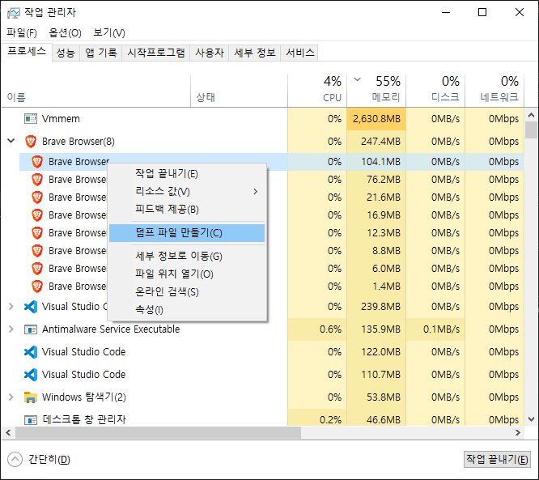
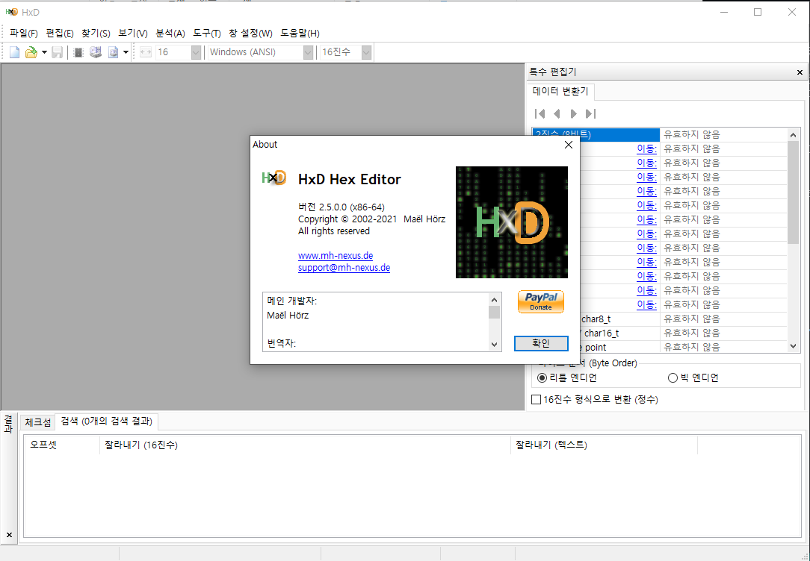

<!-- ### TL;DR (요약)

1. 사용자 입력을 하나하나 바꿔치기 한다.
2. 절대 비밀번호를 문자열로 가지고 있지 않는다.
3. 2번을 지키기 위해 백엔드에 보낼때도 해시로 보낸다. -->

### ※ 참고

> 저는 [brave](https://brave.com/ko/) 브라우저를 사용하고 있어서, 작업관리자와 덤프 파일명에 `brave`라고 적혀있습니다만 chrome 브라우저를 사용해도 내용은 동일합니다.

## 문제의 시작

사내 솔루션의 보안 평가를 진행하던 중 지적 사항으로 사용자가 입력한 패스워드가 메모리에 평문으로 남는다는 지적이 있었습니다. 개인적으로는 아직도 잘 이해가 되지 않는 지적입니다. 백엔드 데이터베이스도 아니고, 프론트엔드에서 저런 지적을 받아야한다니...

요점은 사용자가 비밀번호를 입력하여 로그인 하고, 서비스 사용을 모두 마친 후 로그아웃 했을 때는 브라우저 메모리에 비밀번호가 남아있지 않아야 한다는 것이었습니다.

얼핏 들으면 맞는 말인 것 같습니다. 브라우저라는 것이 우리 솔루션/서비스만을 위한 프로그램이 아닌데, 우리 서비스의 이용이 끝나도 민감 정보를 가지고 있다는 것이 관점에 따라서는 애매할 수 있지요.

하지만 그렇다 할지라도 그것은 브라우저 개발자들이 고민할 문제가 아닐까요? 브라우저 메모리의 안전성을 브라우저 개발자도, OS 개발자도 아닌 서비스/솔루션 개발자인 우리가 왜 대비해야할까요?

이 문제를 풀어보려 머리를 쥐어짜낼 수록 위와 같은 생각은 커져만 갔습니다. 대체 왜... 그러나 사내에는 이런 문제에 대해 납득 가능한 설명이나 도움을 줄 수 있는 분도 없었고, 그저 기한 내에 보안 평가를 마쳐야한다는 목표만 있을 뿐이었죠.

## 테스트 방법

윈도우 환경에서 작업관리자를 켜면 아래와 같이 원하는 프로세스의 메모리 덤프파일을 만들 수 있습니다.

> 

만들어진 덤프파일은 `C:\Users\{사용자명}\AppData\Local\Temp` 경로에 `프로세스 이름.DMP` 파일로 저장됩니다.

이 덤프파일을 [HxD](https://mh-nexus.de/en/hxd/) 같은 Hex 에디터로 열어서 검색해보면 메모리를 조사해볼 수 있습니다.

> 

따라서 브라우저에서 비밀번호를 입력하고 작업관리자에서 브라우저 프로세스의 덤프파일을 뜬 뒤, HxD 에디터로 열어서 검색(`Ctrl + F`)했을 때 비밀번호가 검색되면 안되는 것입니다.

## 언제, 그리고 무엇을 하면 메모리에 저장되는가

일단, 메모리에 비밀번호가 남는 시점을 파악할 필요가 있었습니다. 저희 솔루션을 포함한 여느 웹사이트이던 비밀번호가 입력되고 처리되는 과정은 아래와 같습니다.

1. 사용자가 `<input>` 태그에 비밀번호를 입력
2. javascript에서 DOM 조작을 통해 가져온 후 사용

### 1. 사용자가 `<input>` 태그에 비밀번호를 입력

아래와 같이 `<input>` 태그만 있는 html을 만들어서 입력칸에 여러가지 값을 넣은 후 덤프를 조사해보았습니다.

```html
<body>
    <input id="pwInput" type="password" placeholder="password">
</body>
```

여러번의 테스트를 거쳐, 알게된 사실은 아래와 같습니다.

- `input` 칸이 focus를 잃는 순간(`blur`) 입력 되어있는 값이 메모리에 저장됩니다.
- 그렇게 한번 저장된 값은 다시 클릭하여 수정해도 여전히 메모리에 남아있습니다. (새로 수정한 값도 같이 남습니다)

일반적으로 로그인-로그아웃 과정에서 비밀번호를 입력한 후 "로그인" 버튼을 누르기 때문에 그때 `blur` 이벤트가 발생하므로 이 부분부터 해결 방법을 찾아야합니다. 굳이 "로그인" 버튼을 클릭하지 않더라도, 다른 요소(아이디를 다시 누른다던지, 혹은 화면의 아무 빈 곳이라도)을 클릭하여 focus를 잃을 수 있기 때문에 단순히 로그인 버튼을 없애고 enter키 등을 사용하도록 유도한다고 해서 해결될 문제가 아니었습니다.

우선 이 부분을 해결했다고 가정하고 이어서 javascript 사용시에는 메모리에 남기지 않는 것이 가능한 지 확인해보겠습니다.

### 2. javascript에서 DOM 조작을 통해 가져온 후 사용

사용자가 입력한 아이디/비밀번호를 이용해 서버에 로그인하려면 자바스크립트로 해당 값을 가져와야합니다.

일반적으로는 로그인 버튼을 눌렀을 때 `input`의 값을 가져오도록 코드를 짜겠지만, 위 사례에서 우리는 그렇게 하면 메모리에 이미 남아버린다는 것을 알았습니다. (버튼을 누르는 순간 input의 focus를 잃어버리기 때문) 그래서 `oninput` 이벤트를 이용해서 focus를 잃지않고 값을 가져와 사용해보겠습니다.

```html
<body>
    <input type="password" name="pw" id="pwInput" oninput="handleInput(event)">

    <script>
        const pwInput = document.querySelector("#pwInput");

        let pw;
        function handleInput(event) {
            pw = event.target.value;
        }
    </script>
</body>
```

결과는 focus를 잃지 않고 입력했던 값을 지워도 모든 값이 메모리에 남아있었습니다. 이전에는 focus가 잡혀있는 동안에는 굳이 메모리 어딘가에 저장해놓지 않았던 것이, 이제는 input 이벤트가 발생할 때마다 변수(`pw`)에 값을 저장하기 때문에 메모리에 들어가는 것 같았습니다. 그런데 그렇다 하더라도 **같은 변수에 계속 덮어쓰고 있는데** 왜 이전에 입력했던 값까지도 메모리에 남기는 걸까요?

이는 자바스크립트 언어 구현에 따른 증상으로 추정되는데, 브라우저 엔진마다 다를 수 있기에 정확하게 확인하기는 어렵지만 **추정**은 아래와 같이 해볼 수 있습니다.

- 문자열을 할당할 때 문자열을 heap에 만들고 해당 위치(포인터)를 변수에 저장합니다.
- 다른 문자열로 덮어쓰면 동일 위치에 값을 변경하는 것이 아니라, 다른 위치에 새 문자열을 만들고 변수의 포인터를 변경합니다.

문제는 자바스크립트는 개발자에게 메모리 관리를 맡기지 않으며, 포인터나 GC를 직접 다룰 수 없도록 감춰져 있습니다. 따라서 한번 사용한 문자열을 확실하게 지울 수 있는 방법이 없다는 것입니다. 따라서 이전 문자열이 언제 메모리에서 지워질지는 전적으로 엔진과 OS에 달려있습니다.

그렇다면 이 문제를 어떻게 해결해야할까요? 해결 불가능한 문제인 것일까요? 분명 저에게만 이런 요구사항이 주어진 것이 아니리라는 생각이 들었기에 참고해볼 레퍼런스를 찾아보았습니다. 일반인이 접근할 수 있는 사이트 중 보안이 제일 엄격한 곳이 어딜까요? 아마 은행 웹사이트일 것입니다. 저는 이어서 은행 웹사이트들이 비밀번호를 어떻게 처리하고 있는지를 확인해보았습니다.

(다음 글에 계속)