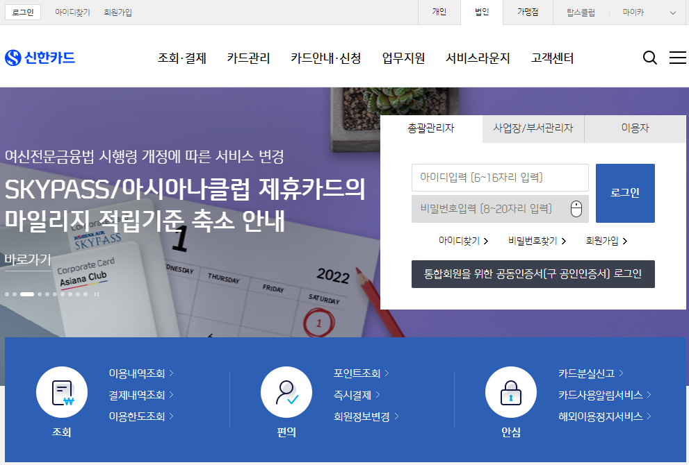
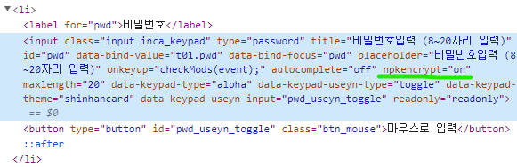
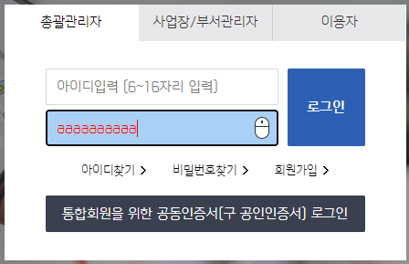

> 본 글은 지난 '비밀번호를 브라우저 메모리에서 숨기기 (1)'에서 이어집니다.

## 지난 문제 요약

사용자가 `input` 태그에 비밀번호를 입력하고 나면, 크게 아래 두가지 행위에 의해 메모리에 남게 됩니다.

1. `<input>`의 `blur` 이벤트가 일어나는 경우 (즉, `focus`를 잃는 경우)
2. 자바스크립트 변수에 문자열을 저장하는 경우

두 가지 경우를 어떻게 해결해야 하는지 알아보기 위해 나름 보안이 중요한 ~~은행~~신용카드 사이트를 참고해보았습니다.

## XX카드 웹사이트 사례

회사에서 제공하는 법인카드의 홈페이지를 들어가보았습니다.

> 

들어가면 우선 보안프로그램을 설치하라고 합니다. 사용하는 보안 프로그램은 `nProtect Online Security`인데 이것이 후술할 키보드 입력에 영향을 미치는 것 같습니다.

이곳에서 아이디와 비밀번호를 입력하고 로그인을 한 뒤, 동일하게 브라우저의 메모리 덤프를 떠서 비밀번호를 검색해보았습니다. 결과는 **비밀번호가 나오지 않았습니다**. 레퍼런스를 찾았으니 이제 어떻게 구현하였는지 뜯어보아야 합니다.

## 레퍼런스 뜯어보기

우선 개발자 도구를 열어보려고 하니 `Ctrl + Shift + I`가 먹히지 않는 것을 발견했습니다. 하지만 브라우저 메뉴를 통해 개발자도구를 열 수는 있었습니다.

개발자도구로 비밀번호 `input` 태그를 검사해보니, `npkencrypt="on"`와 같은 속성(property)가 있었습니다. 아마 위에서 설치한 보안 프로그램이 키보드 관련 입력을 처리하는 것으로 추정 됩니다.

> 

대체 외부 프로그램을 통해 어떻게 브라우저 입력에 영향을 줄 수 있는지 너무 궁금하였지만, 알아낸다 쳐도 제가 외부 보안프로그램을 따라 만들 순 없기 때문에 여기까지인가 싶었습니다.

하지만 `input` 태그의 속성값을 이용해 입력 값을 외부 프로그램에 위임한다고 하더라도, 일단은 `input` 태그에 값이 입력되고 focus를 잃는 순간 메모리에 저장되는 것은 어떻게 막는 것인지 궁금해졌습니다. 그래서 저는 개발자도구에서 `input`태그의 `type="password"` 값을 `type="text"`로 변경하고 비밀번호를 쳐보았고 깜짝 놀랄만한 발견을 하게 됩니다.

> 

위와 같이 제가 비밀번호를 입력하면 한글자씩 입력하는 순간 다른 값(`a`)으로 바꿔치기를 하고 있었습니다. 이렇게 되면 입력 후에 `blur` 이벤트가 일어나더라도 입력칸 안에는 바꿔치기한 의미 없는 문자열이 들어있기 때문에 메모리에는 비밀번호가 남지 않게 됩니다.

**즉, 처음에 파악한 1번 문제인 `input` 태그 자체의 값이 메모리에 남는 문제는 이렇게 입력값을 한글자씩 다른 값으로 치환함으로 해결할 수 있는 것입니다.**

## 그럼 실제 비밀번호는 어떻게...?

그런데 이렇게 글자를 치환해버리면, 최종적으로 입력칸에 남는 값은 의미없는 값이 되어버리고 로그인 API에 보낼 실제 비밀번호 값은 어디서 구해야할까요?

우선 `<input onkeydown="handleKeyDown(event)">` 이런 식으로 `onkeydown` 이벤트에 함수를 등록하여 입력하는 글자마다 처리를 할 수 있습니다.

> 참고로 `onkeypress`는 이제 deprecated 되었습니다. 그리고 지난 번 사용했던 `oninput` 이벤트는 `preventDefault()`가 되지 않는 이벤트(취소할 수 없는 이벤트)이기 때문에 `onkeydown`을 사용하는 것이 더 편합니다.

이때 사용자가 입력한 글자를 받을 수 있고 `input.value`에는 다른 값을 넣어줌으로 1번 문제를 해결했습니다. 그러면 사용자가 입력한 실제 값을 별도의 배열에 넣어두었다가 보내면 되지 않을까요?

```js
let pw = [];
        
function handleKeyDown(event) {
    event.preventDefault();
    if (event.altKey || event.ctrlKey || event.shiftKey) return;
    pw.push(event.key); // 실제 입력값은 배열에 저장
    event.target.value += 'a'; // 아무 의미 없는 값으로 채움
}
```

이렇게 하면 실제 사용자가 입력한 비밀번호는 배열로 `pw` 변수에 저장되고, `input` 태그에는 사용자가 입력한 자릿수 만큼의 `'a'`라는 문자열이 들어가게 됩니다.

그리고 로그인 API에는 배열의 들어있는 값을 합쳐서 보내면 될까요?

**...아니요!**

사용자의 입력값을 한글자씩 담은 배열 `pw`를 최종적으로 합쳐 문자열로 만드는 순간, 브라우저 메모리에는 해당 문자열이 남게됩니다. 이 문자열을 메모리에서 지우는 방법을 찾아보았으나, 전혀 방법이 없었습니다. (혹시 있다면 댓글 부탁드립니다)

따라서 2번 문제의 해결방법은 "문자열을 쓰지 않는 것"입니다.

제일 편한 것은 배열을 그대로 JSON으로 보내는 것입니다. 그럴려면 백엔드 개발자와 협의가 필요하겠죠. 저 같은 경우에는 조금 다른 방법으로 협의했는데, 배열에 담긴 글자들을 하나씩 `hash`하여서 하나의 문자열로 길게 합친 다음, 다시 최종적으로 `hash`하는 것입니다.

```js
let pw = ["p", "a", "s", "s", "w", "o", "r", "d"];

// ...각 요소마다 해시함수를 거치면 (생략)

[
    "148de9c5a7a44d19e56cd9ae1a554bf67847afb0c58f6e12fa29ac7ddfca9940",
    "ca978112ca1bbdcafac231b39a23dc4da786eff8147c4e72b9807785afee48bb",
    "043a718774c572bd8a25adbeb1bfcd5c0256ae11cecf9f9c3f925d0e52beaf89",
    "043a718774c572bd8a25adbeb1bfcd5c0256ae11cecf9f9c3f925d0e52beaf89",
    //...후략
]

// ...위 결과를 다시 합친 다음 하나의 해시값으로 나오도록 다시 해싱

let finalPw = "9440bb22372bb0074e78dbabf690b16e2688770ec5567a4e3226bcf8d79868eb";

// 위의 값을 비밀번호로 보고 API에 보낸다.
```

참고로, 그럼 배열에 담긴 글자들도 메모리에 어짜피 남는 것 아닌가 라는 의문이 드실 수 있습니다. 제가 테스트해보니, 자바스크립트 배열은 연속된 메모리 주소에 저장되지 않습니다. 마치 `LinkedList`처럼 흩어져 있습니다.

아마 자바스크립트 배열은 길이가 런타임에 결정되는 동적인 배열이고, 여러 Type을 함께 담을 수 있기 때문에 `Stack`이 아닌 `Heap`에 저장되는 것 같습니다. 메모리 덤프를 떠보면 배열의 요소들이 서로 다른 주소에 흩어져 있어서 전체 입력값을 유추할 수 없습니다.

따라서 배열을 사용하면 자바스크립트 문자열이 메모리에 남는 문제를 해결할 수 있는 것입니다. (다만 API 개발자와의 협의가 필요)

이렇게 하여 저는 저희 회사 솔루션의 보안기능 평가를 통과할 수 있게 되었습니다.

일반적으로는 아마 XX카드사 홈페이지 처럼 키보드 보안프로그램을 연동시켜 해결하는 것으로 알고 있습니다. 만일 회사에서 제대로 지원을 해준다면 이런 방법이 더 정석이니 그렇게 하는 것이 좋습니다. 이 가이드는 제가 어떻게든 삽질을 통해 해결한 방법을 작성한 것이니 참고만 해주시면 감사하겠습니다.
