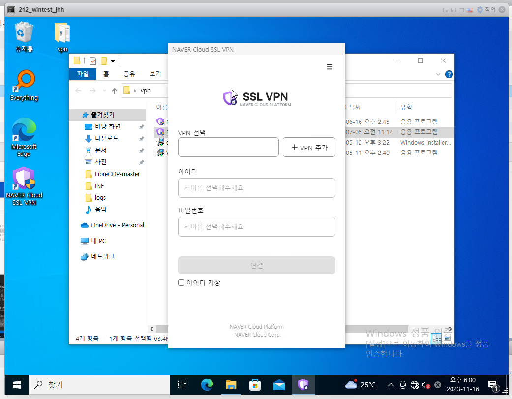
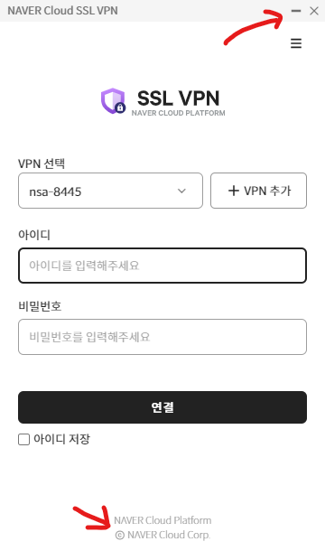
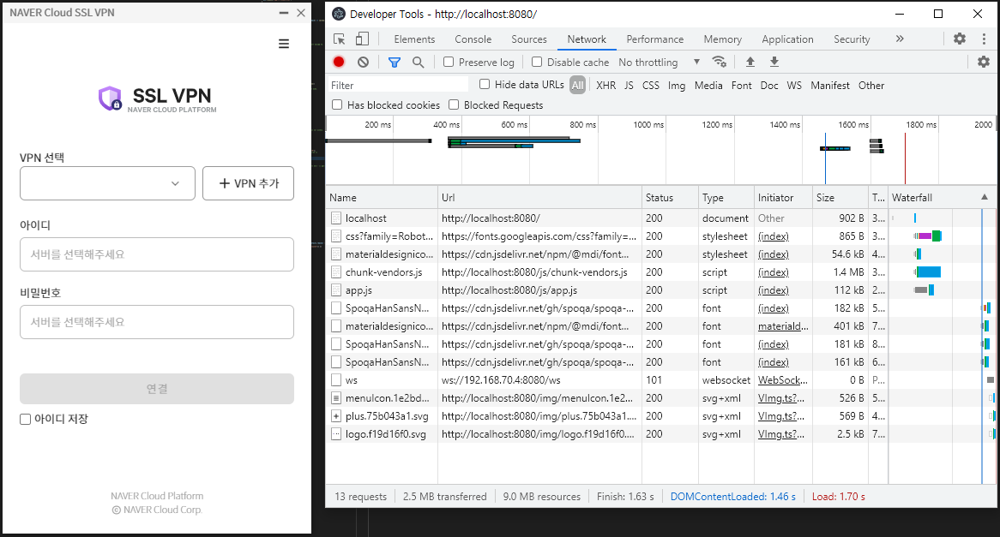
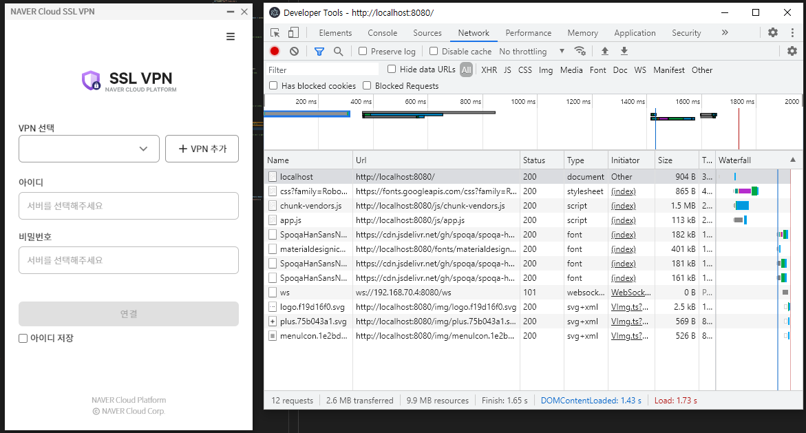
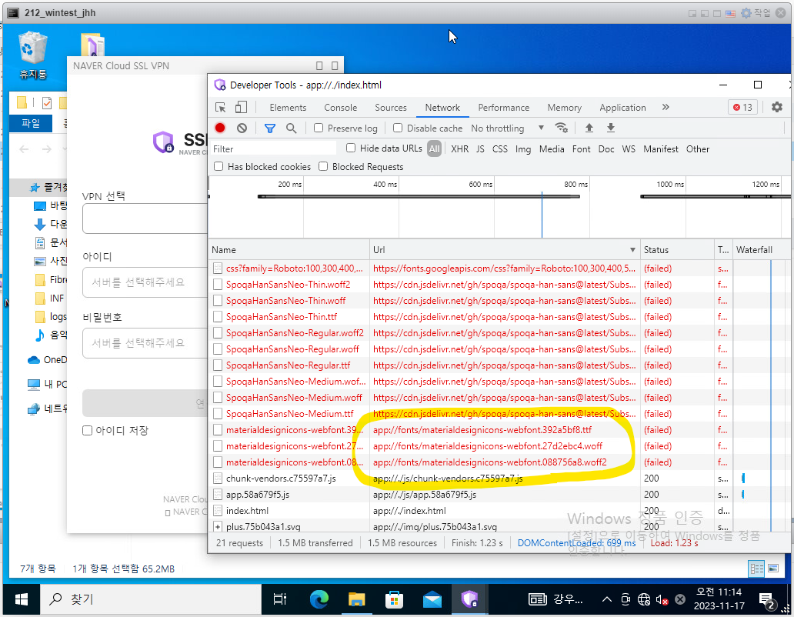
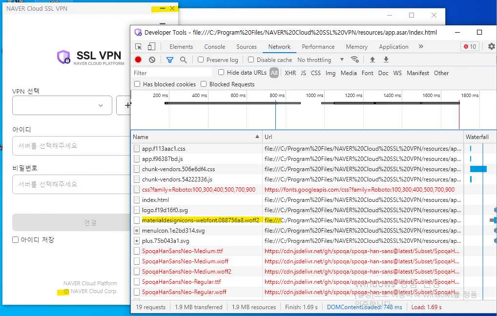

오늘은 회사에서 사용자 이슈를 해결한 사례를 가지고 왔습니다. 프론트엔드 개발자는 일반적으로 인터넷 연결이 되는 클라이언트를 가정하고 개발을 하는 경우가 많기에 특이한 사례라고 생각되어서 공유차 기록하게 되었습니다.

### 문제 상황

인터넷이 안되는 폐쇄망 환경에서 우리 애플리케이션(`electron`으로 만든 데스크톱 앱)을 실행하면 아이콘이 있어야할 자리에 아무것도 보이지 않는 현상이 나타났습니다.



원래 정상 애플리케이션의 모습은 아래와 같습니다.



### 초기 진단

아이콘을 불러오는 CSS 또는 폰트 파일이 누락되었거나 어떠한 이유로 불러오지 못한 것으로 추정됩니다. 인터넷이 안되는 환경에서 나타나는 증상인 것으로 보아, 아마도 외부 경로에서 불러오는 형태로 들어가 있을 것 같습니다.

### 가설 검증

개발환경에서 네트워크탭을 열어서 외부에서 불러오고 있는 asset들 중 아이콘 관련한 내역이 있는지 살펴보았습니다.



역시나 사용중인 머티리얼 디자인의 css와 font파일을 CDN에서 불러오고 있는 것을 확인할 수 있었습니다. 해당 css와 폰트파일을 내장 번들할 수 있도록 방법을 찾아서 적용하면 해결될 것 같습니다.

### 1차 해결 시도

해당 파일을 소스에서 검색해보니 아래와 같이 `link`태그로 포함되어 있었습니다.

```html
<link href="https://cdn.jsdelivr.net/npm/@mdi/font@5.x/css/materialdesignicons.min.css" rel="stylesheet">
```

Vuetify 문서를 참고하니, 링크형식이 아닌 `npm install`로 내장할 수 있는 방법이 있어서 적용하였습니다.

```sh
npm install @mdi/font -D
```

```js
import '@mdi/font/css/materialdesignicons.css' // Ensure you are using css-loader
import { createVuetify } from 'vuetify'

export default createVuetify({
  icons: {
    defaultSet: 'mdi', // This is already the default value - only for display purposes
  },
})
```

이렇게 변경 후 다시 개발자 도구를 확인해보니 이전처럼 cdn에서 불러오는 것이 아닌, 로컬에서 참조하고 있는 것을 확인할 수 있었습니다.



### 그러나...

그런데 최종 확인을 위해 이 상태에서 프로덕션으로 빌드하여 설치한 후 확인해보니 아이콘 위치에 이번에는 네모 모양의 글자가 나타나는 증상이 새롭게 나타났습니다. 마찬가지로 개발자도구를 확인해보니 내장시킨 폰트를 불러오지 못하는 것으로 보였습니다.



### 2차 분석

빌드한 후에 개발자도구를 봤을 때 `https://`가 아닌 `app://` 프로토콜에서 불러오는 것을 보아 내부에서 폰트파일을 찾고 있는 것은 확실합니다. 하지만 구체적인 경로를 봤을 때, 성공적으로 불러온 다른 파일들을 보면 상대경로인 `app://./`에서 시작하는데 문제가 된 폰트파일은 `app://fonts/...`와 같이 절대경로로 시작하는 곳에서 찾고있는 것을 알 수 있었습니다. 그래서 이 `app://` 프로토콜 관련 설정에서 해결을 시도해봐야할 것 같았습니다.

### 커스텀 프로토콜

> 출처1: https://github.com/nklayman/vue-cli-plugin-electron-builder/issues/1647#issuecomment-1019400838

> 출처2: https://nklayman.github.io/vue-cli-plugin-electron-builder/guide/configuration.html#changing-the-file-loading-protocol

일반적으로 로컬파일을 참조할 때 사용되는 프로토콜은 `file://`입니다. 우리가 html파일을 만들고 그걸 더블 클릭해서 브라우저로 실행하면 주소창에 써있는 프로토콜이 바로 `file://`입니다. 그런데 지금 보듯이 `app://` 이라는 이상한 프로토콜을 사용하는 것으로 보아 우리 소스에서 커스텀으로 정의한 프로토콜일 것으로 추정해볼 수 있습니다.

확인해보니, 프로젝트를 처음 시작할 때 `@vue/cli`를 이용해서 `vue add electron-builder`라는 명령어를 통해 프로젝트를 셋업하였는데, 이 때 깔리는 기본 템플릿 코드에 `app://` 프로토콜을 설정하는 코드가 있었습니다. 위 출처들을 참고하여서 해당 코드를 없애고 다시 기본값인 `file://` 프로토콜을 사용하도록 변경해보았습니다.

### 해결



그 결과 `file://` 프로토콜에서는 모든 참조가 정상적인 경로로 이루어지고 있어서 내장한 폰트파일도 정상적으로 불러오고, 따라서 아이콘도 모두 제대로 표기되는 것을 확인할 수 있습니다.

만일 일반적인 웹 애플리케이션이었다면 CDN에 있는 파일들을 소스내의 `assets/`나 `public/`폴더로 옮겨놓고 경로를 수정하기만 해도 됐을 텐데, 이렇게 `electron`만의 문제까지 같이 겹쳐서 해결하기가 더욱 어려웠습니다.

끝.