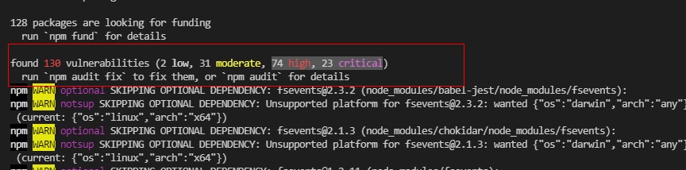

오늘은 빌드 시에 발생하는 취약성 로그를 해결하라는 요청을 받았습니다.

저희 솔루션은 `make` 스크립트를 이용하여 빌드를 하는데, 이때 `npm audit fix`가 함께 들어가있습니다. 때문에 빌드를 하게 되면 호환이 깨지지 않는 범위내에서 최대한 취약성을 제거하고 빌드를 하게 되는데, 이 문구가 나오지 않도록 개발단계에서 미리 패키지들을 업데이트해달라는 뜻입니다. 또한 `npm audit fix`로 해결되지 않은 채 빌드 되는 부분도 있어서 (하위 호환이 깨지는 경우에는 skip하기 때문) 이 부분도 함께 해결을 해야했습니다.

## 사용하지 않는 패키지로부터 발생하는 취약점 제거

먼저 `npm audit`을 해보면 아래와 같이 총 130개의 취약점이 발견되었다고 뜨는 상태입니다.

> 

제가 제일 먼저 한 것은, **실제로 사용하지 않는데 설치된 패키지들**에 의해 발생하는 취약점을 제거하는 것입니다. 프로젝트를 처음 초기화 할 때, `@vue/cli`를 사용하였는데 이때 사용하지 않을 도구까지 함께 설치했던 것 같습니다. `package.json`안에 `dependencies`와 `devDependencies`를 보고 사용하지 않는 패키지가 있으면 삭제합니다. 아래와 같이 사용하지 않는 패키지들을 삭제하고 나니 확연히 줄어든 취약점 개수를 알 수 있었습니다.

1. `eslint-config-vuetify` 제거 후

`found 128 vulnerabilities (2 low, 30 moderate, 73 high, 23 critical)`

2. `@vue/cli-plugin-e2e-cypress` 제거 후

`found 119 vulnerabilities (2 low, 27 moderate, 69 high, 21 critical)`

3. `@vue/cli-plugin-unit-jest` 제거 후

`found 39 vulnerabilities (2 low, 10 moderate, 21 high, 6 critical)`

남은 **39개**의 취약점은 사용하고 있는 패키지로부터 발생하고 있었습니다.

## npm audit --production으로 다시 검사

위의 39개의 취약점을 모두 수정해야할 필요는 없었습니다. 확인해보니, `devDependecies`에 있는 항목들은 빌드 시에는 포함되지 않는 부분이므로 무시해도 괜찮습니다. npm v6 기준으로 `npm audit`을 할 경우 이 `devDependencies`까지 포함하여 검사를 하게 됩니다. 실제 빌드 시 사용되는 패키지들만 검사하고 싶다면 `--production`이라는 옵션을 주면 됩니다.

```
[root@root nq-view-vuetify]# npm audit --production
                                                                                
                       === npm audit security report ===                        
                                                                                
# Run  npm install marked@4.0.16  to resolve 2 vulnerabilities
SEMVER WARNING: Recommended action is a potentially breaking change
┌───────────────┬──────────────────────────────────────────────────────────────┐
│ High          │ Inefficient Regular Expression Complexity in marked          │
├───────────────┼──────────────────────────────────────────────────────────────┤
│ Package       │ marked                                                       │
├───────────────┼──────────────────────────────────────────────────────────────┤
│ Dependency of │ marked                                                       │
├───────────────┼──────────────────────────────────────────────────────────────┤
│ Path          │ marked                                                       │
├───────────────┼──────────────────────────────────────────────────────────────┤
│ More info     │ https://github.com/advisories/GHSA-5v2h-r2cx-5xgj            │
└───────────────┴──────────────────────────────────────────────────────────────┘


┌───────────────┬──────────────────────────────────────────────────────────────┐
│ High          │ Inefficient Regular Expression Complexity in marked          │
├───────────────┼──────────────────────────────────────────────────────────────┤
│ Package       │ marked                                                       │
├───────────────┼──────────────────────────────────────────────────────────────┤
│ Dependency of │ marked                                                       │
├───────────────┼──────────────────────────────────────────────────────────────┤
│ Path          │ marked                                                       │
├───────────────┼──────────────────────────────────────────────────────────────┤
│ More info     │ https://github.com/advisories/GHSA-rrrm-qjm4-v8hf            │
└───────────────┴──────────────────────────────────────────────────────────────┘


found 2 high severity vulnerabilities in 73 scanned packages
  2 vulnerabilities require semver-major dependency updates.
```

`npm audit --production` 결과는 위와 같습니다. **단 2개**의 `high` 취약점이 발견되었으며, 해결하기 위해서는 `marked` 패키지를 `4.0.16`으로 업데이트해야한다고 친절하게 알려줍니다. 다만 업데이트를 하게되면 호환성이 깨질 수 있다고 경고하네요. (`potentially breaking change`)

해당 패키지는 저희 솔루션의 "도움말" 부분에 마크다운 문서를 렌더링하기 위해 사용하고 있었으며, 경고대로 `4.0.16`으로 업데이트 후에 도움말이 나오지 않는 문제가 발생했습니다. 이는 해당 패키지 문서를 참고하여 바뀐 API대로 코드를 수정해야합니다.

코드를 수정하여 해결하였으며 최종 `npm audit --production`의 결과는 아래처럼 나옵니다.

```
[root@root nq-view-vuetify]# npm audit --production
                                                                                
                       === npm audit security report ===                        
                                                                                
found 0 vulnerabilities
 in 73 scanned packages
```
