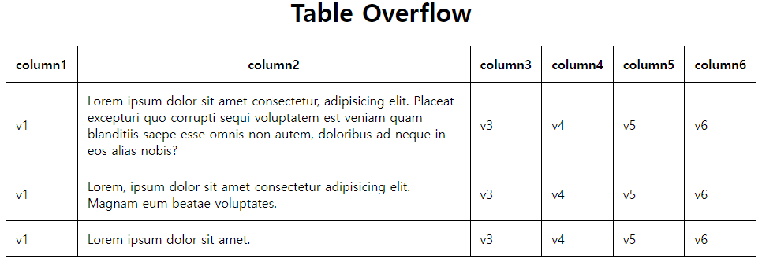

### 마주친 문제

백오피스 개발을 하다보면 테이블 형태의 UI를 많이 쓰곤 합니다. 이때 컬럼(필드)의 종류가 많거나 아니면 단순히 한 필드의 내용 자체가 길어서 두줄로 넘어가거나, 보기 싫을 정도로 큰 비율을 차지하고 있는 경우가 있습니다.

> 

위 그림에서 보듯, `column2`의 내용이 각 행마다 4줄, 2줄, 1줄로 다르게 나오는 것이 통일감을 해치는 느낌이 있습니다.

### 해결 방법

그럼 해결 방법은 간단합니다. 셀 안의 내용이 길어져서 특정 너비에 도달하는 경우에는 두 줄로 넘기지 않고 `truncate`하는 것입니다. CSS를 이용하면 이런 작업을 간단하게 구현할 수 있습니다.

```css
td {
    max-width: 500px;
    overflow: hidden;
    white-space: nowrap;
    text-overflow: ellipsis;
}
```

이렇게 해주면 `td` 태그의 길이가 500px을 넘어가면 말줄임표("...") 처리를 해줍니다.

> 

보기 좋게 모두 같은 높이로 맞춰졌습니다.

그런데 그럼 원래 내용을 모두 보고싶으면 어떻게 해야할까요? 두가지 방법이 있습니다.

1. `:hover` 의사 클래스(선택자) 활용
2. `title` HTML 속성값 활용

먼저 `:hover` 선택자를 활용하는 방법은 단순히 마우스를 올렸을 때 위의 CSS 설정을 다시 초기화 해주는 방법입니다. 이때 다른 건 건들 필요 없고, `white-space` 값만 초기값인 `normal`로 바꿔주면 마우스를 올렸을 때 잠깐 기존처럼 모든 내용이 나타납니다.

```css
td:hover {
    white-space: normal;
}
```

(마우스를 올리면 맨 처음 스크린샷과 같이 나오기 때문에 따로 스크린샷을 찍지 않았습니다)

그리고 두번째 방법은 거의 대부분의 HTML 태그에 존재하는 `title` 속성을 이용하는 것입니다.

- HTML `title` property ([MDN 링크](https://developer.mozilla.org/en-US/docs/Web/API/HTMLElement/title))

`title` 속성에 원래 내용을 넣어주면 마우스를 올렸을 때 툴팁으로 내용을 표시해줍니다.

> 

끝.