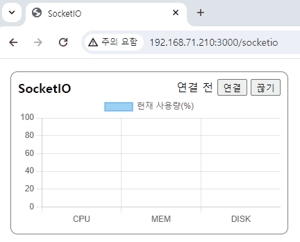
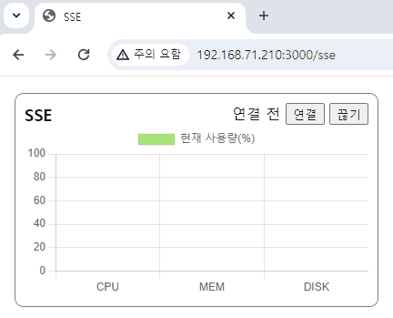

어드민 페이지를 개발하다보면, 아래의 상황이 생깁니다.

1. 대시보드와 같은 모니터링 화면에서 실시간으로 데이터가 변경되는 경우
2. 관리자에게 알림을 발송해야하는 경우

위 두가지 경우는 일반적인 Rest API 호출로는 해결할 수 없습니다. 일반적인 Rest API는 클라이언트에서 GET/POST 등의 요청을 보내면 응답이 오는 구조이기 때문입니다. 위 상황에서는 서버에서 데이터가 변경되었을 때 클라이언트에게 알려주어야하는 상황입니다.

이럴 때 사용하는 기술이 바로 Server Push입니다. Server Push를 하는 방법으로는 Polling, Long-Polling, Streaming, SSE, Websocket 등이 있는데 이 중에서도 SSE와 SocketIO에 대해 비교 조사를 해보았습니다.

### SocketIO

Socket.io는 Websocket을 기반으로 하는 라이브러리입니다. 일반적인 Websocket과 다른 점은 웹소켓을 지원하지 않는 환경에서는 HTTP Long-Polling으로 fallback을 지원하고, 또 HeartBeat 메커니즘을 통해 접속이 끊어지는 경우 자동 재연결까지 해준다는 점입니다. 또한 API들이 잘 추상화되어 있어서 코드를 작성하기도 좀 더 편합니다. 참고로 그 자체로 Websocket 구현을 따르지는 않기 때문에 일반적인 Websocket 인터페이스를 그대로 대체할 수는 없습니다.

Socket.io는 여러 언어로 구현되어있어서 굳이 NodeJS를 백엔드로 사용하지 않더라도 언어에 맞는 라이브러리를 쓰면 사용이 가능합니다. (물론 클라이언트는 웹에서 JS로만 사용이 가능합니다)

아래는 간단하게 NodeJS에서 Express를 이용해 SocketIO를 구성한 예제 코드입니다. 실제로는 데이터가 변경될 때 `emit`을 하는 것이 맞지만, 여기 예시에서는 `setInterval`을 통해 주기적으로 랜덤 데이터를 전송합니다.

```javascript
// ...나머지 import문 스킵
import { Server } from 'socket.io'

const app = express()
const server = createServer(app)
const io = new Server(server)

app.get('/socketio', (req, res) => {
  res.sendFile(join(__dirname, 'public/socketio.html'))
})

io.of('/socketio/cpumemdisk').on('connection', socket => {
  socket.emit('init-msg', 'connection successful')
  const intervalId = setInterval(() => {
    socket.emit('data', {
      data: [getRandomInt(50, 100), getRandomInt(1, 50), getRandomInt(50, 100)],
    })
  }, 500)

  socket.on('disconnect', (reason, description) => {
    console.log(reason, description)
    clearInterval(intervalId)
  })
})

server.listen(3000, () => {
  console.log('server running at http://localhost:3000')
})

function getRandomInt(min, max) {
  const minCeiled = Math.ceil(min)
  const maxFloored = Math.floor(max)
  return Math.floor(Math.random() * (maxFloored - minCeiled) + minCeiled) // The maximum is exclusive and the minimum is inclusive
}
```

이렇게 한 뒤 클라이언트에서는 아래와 같이 작성하였습니다.

```html
<!-- head 스킵 -->
<body>
  <main class="container">
    <section class="card">
      <div class="card-header">
        <span class="title">SocketIO</span>
        <div>
          <span id="socket-status">연결 전</span>
          <button onclick="connectSocket()">연결</button>
          <button onclick="disconnectSocket()">끊기</button>
        </div>
      </div>
      <canvas id="socket-chart"></canvas>
    </section>
  </main>

  <script src="/socket.io/socket.io.js"></script>
  <script src="https://cdn.jsdelivr.net/npm/chart.js"></script>

  <script>
    const socketChart = new Chart(document.getElementById('socket-chart'), {
      type: 'bar',
      data: {
        labels: ['CPU', 'MEM', 'DISK'],
        datasets: [
          {
            label: '현재 사용량(%)',
            data: [0, 0, 0],
            borderWidth: 1,
          },
        ],
      },
      options: { scales: { y: { min: 0, max: 100 } } },
    })

    const socket = io('/socketio/cpumemdisk', { autoConnect: false })

    socket.on('data', ({ data }) => {
      socketChart.data.datasets.at(0).data = [...data]
      socketChart.update()
    })

    function connectSocket() {
      socket.connect()
      document.getElementById('socket-status').textContent = '연결 됨'
    }

    function disconnectSocket() {
      socket.disconnect()
      document.getElementById('socket-status').textContent = '연결 해제'
    }
  </script>
</body>
```

클라이언트쪽 socketio 라이브러리는 기본값으로는 소켓 객체를 생성하자마자 연결이 됩니다. 이를 수동으로 연결하기 위해 `autoConnect: false`를 옵션으로 주었습니다. 그리고 연결버튼을 눌렀을 때 `connect()`메소드를 호출합니다. 서버쪽의 `emit`은 이벤트로 수신되기 때문에 `on()` 메소드의 콜백으로 데이터가 전송될 때 무엇을 할지 코드를 작성할 수 있습니다.

여기서는 `chart.js`를 이용해서 차트의 값을 동적으로 변경하기 위해 사용하고 있습니다. 따라서 0.5초마다 그래프의 크기가 변경되게 됩니다. 결과는 화면은 아래처럼 됩니다.

> 

### SSE (Server Sent Event)

SSE는 일반 HTTP를 이용하되, `text/event-stream`을 타입으로하는 응답을 보내어 서버가 클라이언트에게 지속적으로 메세지를 전달 할 수 있게 합니다. 서버쪽에서는 일반 HTTP를 이용하기 때문에 굳이 별다른 라이브러리를 사용할 필요가 없다는 점이 특징입니다. 다만 클라이언트에서는 `fetch`나 `axios`같은 함수를 쓰는 것은 아니고, 브라우저에 내장된 `EventSource`라는 인터페이스를 이용해서 호출해야합니다.

먼저 서버쪽 예시입니다.

```javascript
// ...다른 부분은 이전 socket.io 예시와 동일

app.get('/sse/cpumemdisk', (req, res) => {
  res.setHeader('Cache-Control', 'no-cache')
  res.setHeader('Content-Type', 'text/event-stream')
  res.setHeader('Access-Control-Allow-Origin', '*')
  res.setHeader('Connection', 'keep-alive')
  res.flushHeaders()

  let intervalId = setInterval(() => {
    res.write(
      `data: ${JSON.stringify({
        data: [getRandomInt(1, 50), getRandomInt(50, 100), getRandomInt(1, 50)],
      })}\n\n`
    ) // res.write() instead of res.send()
  }, 500)

  res.on('close', () => {
    console.log('client dropped me')
    clearInterval(intervalId)
    res.end()
  })
})
```

일반 `GET` 요청 라우트 핸들러에 특정 헤더와 응답을 조합하여 구현할 수 있으며, 특이한 점으로는 원래 express는 첫 데이터 청크와 함께 헤더를 보내도록 최적화가 되어있는데 헤더를 먼저 보내야하기 때문에 중간에 `flushHeaders()`를 호출해주는 것을 볼 수 있습니다. 그리고 `send()`대신에 `write()`를 쓰는 것도 눈여겨볼만 한 부분입니다. (물론 이건 Node.js, Express를 쓸 때만 해당하는 사항입니다)

보시다시피 일반적인 GET 요청 API를 만드는 것과 큰 틀은 다르지 않습니다. 하지만 클라이언트쪽을 보면 조금 다릅니다.

```html
<script>
  const sseChart = new Chart(document.getElementById('sse-chart'), {
    type: 'bar',
    data: {
      labels: ['CPU', 'MEM', 'DISK'],
      datasets: [
        {
          label: '현재 사용량(%)',
          data: [0, 0, 0],
          borderWidth: 1,
          backgroundColor: 'rgba(120, 220, 50, 0.65)',
        },
      ],
    },
    options: { scales: { y: { min: 0, max: 100 } } },
  })

  let evtSource
  function connectSocket() {
    if (evtSource) return
    evtSource = new EventSource('/sse/cpumemdisk')
    evtSource.addEventListener('message', ({ data }) => {
      sseChart.data.datasets.at(0).data = [...JSON.parse(data).data]
      sseChart.update()
    })
    document.getElementById('sse-status').textContent = '연결 됨'
  }

  function disconnectSocket() {
    evtSource?.close()
    evtSource = null
    document.getElementById('sse-status').textContent = '연결 해제'
  }
</script>
```

클라이언트에서는 굳이 라이브러리를 쓸 필요는 없지만 그렇다고 일반 HTTP 요청을 하듯이 `fetch`를 쓰지도 않습니다. `EventSource`라는 인터페이스를 통해 객체를 만들고, `addEventListener`를 이용해서 `message` 이벤트를 통해 데이터를 수신할 수 있습니다.

결과 화면은 아래와 같고 당연히 겉으로 볼 때는 SocketIO 구현과 동일합니다.

> 

이렇게 둘다 사용해보았을 때 큰 차이는 없는 것 같습니다. 다만 외부 라이브러리를 사용할 수 있느냐의 여부에 따라 갈릴 수 있을 것 같고, 인프라 관점에서 SocketIO는 웹소켓 관련 방화벽 정책 등을 추가로 설정해주어야할 수 있습니다. SSE의 경우에는 HTTP 기반이고, 클라이언트도 브라우저 내장 API를 활용하기 때문에 호환성이 좋을 것으로 보이나, SocketIO보다는 조금 더 신경써야할 것이 많은 것 같습니다. (헤더 설정 등)

이번 기술 검토내용을 토대로 사내솔루션의 알림 기능에 적용해보려고 합니다.
