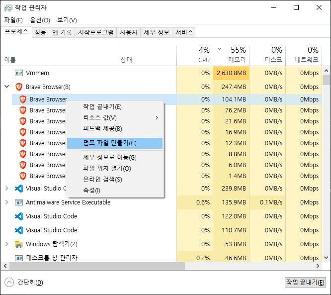
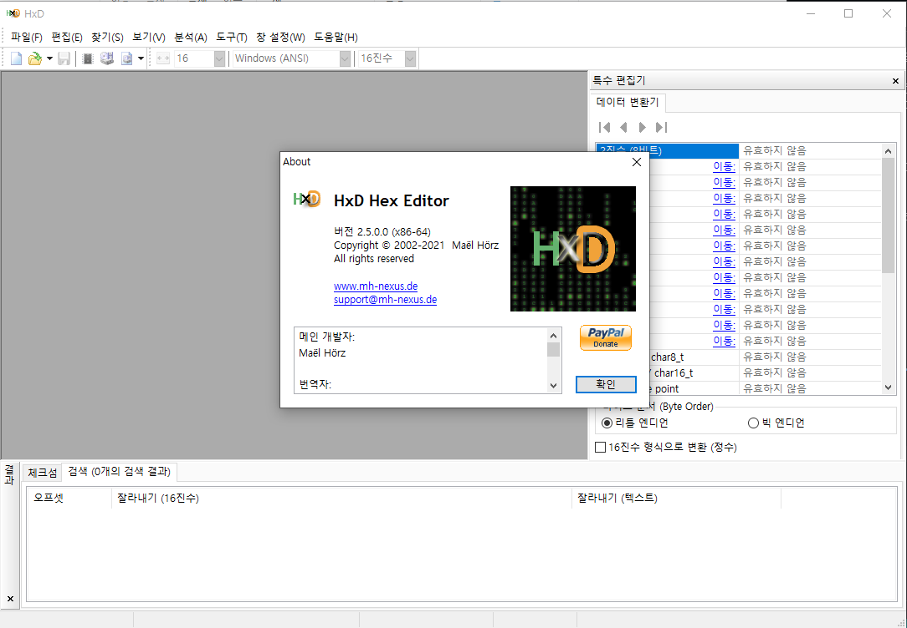
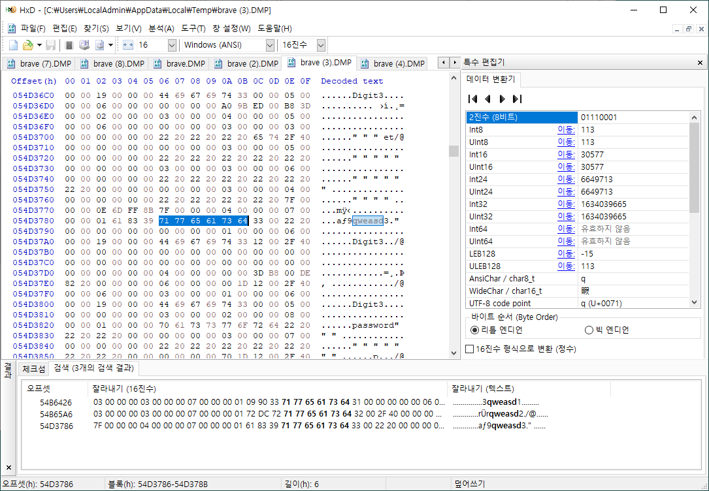

<!-- ### TL;DR (요약)

1. 사용자 입력을 하나하나 바꿔치기 한다.
2. 절대 비밀번호를 문자열로 가지고 있지 않는다.
3. 2번을 지키기 위해 백엔드에 보낼때도 해시로 보낸다. -->

### ※ 참고

> 저는 [brave](https://brave.com/ko/) 브라우저를 사용하고 있어서, 작업관리자와 덤프 파일명에 `brave`라고 적혀있습니다만 chrome 브라우저를 사용해도 내용은 동일합니다.

## 문제의 시작

사내 솔루션의 보안 평가를 진행하던 중 지적 사항으로 사용자가 입력한 패스워드가 메모리에 평문으로 남는다는 지적이 있었습니다. 개인적으로는 아직도 잘 이해가 되지 않는 지적입니다. 백엔드 데이터베이스도 아니고, 프론트엔드에서 저런 지적을 받아야한다니...

요점은 사용자가 비밀번호를 입력하여 로그인 하고, 서비스 사용을 모두 마친 후 로그아웃 했을 때는 브라우저 메모리에 비밀번호가 남아있지 않아야 한다는 것이었습니다.

얼핏 들으면 맞는 말인 것 같습니다. 브라우저라는 것이 우리 솔루션/서비스만을 위한 프로그램이 아닌데, 우리 서비스의 이용이 끝나도 민감 정보를 가지고 있다는 것이 관점에 따라서는 애매할 수 있지요.

하지만 그렇다 할지라도 그것은 브라우저 개발자들이 고민할 문제가 아닐까요? 브라우저 메모리의 안전성을 브라우저 개발자도, OS 개발자도 아닌 서비스/솔루션 개발자인 우리가 왜 대비해야할까요?

이 문제를 풀어보려 머리를 쥐어짜낼 수록 위와 같은 생각은 커져만 갔습니다. 대체 왜... 그러나 사내에는 이런 문제에 대해 납득 가능한 설명이나 도움을 줄 수 있는 분도 없었고, 그저 기한 내에 보안 평가를 마쳐야한다는 목표만 있을 뿐이었죠.

## 테스트 방법

윈도우 환경에서 작업관리자를 켜면 아래와 같이 원하는 프로세스의 메모리 덤프파일을 만들 수 있습니다.

> 

만들어진 덤프파일은 `C:\Users\{사용자명}\AppData\Local\Temp` 경로에 `프로세스 이름.DMP` 파일로 저장됩니다.

이 덤프파일을 [HxD](https://mh-nexus.de/en/hxd/) 같은 Hex 에디터로 열어서 검색해보면 메모리를 조사해볼 수 있습니다.

> 

따라서 브라우저에서 비밀번호를 입력하고 작업관리자에서 브라우저 프로세스의 덤프파일을 뜬 뒤, HxD 에디터로 열어서 검색(`Ctrl + F`)했을 때 비밀번호가 검색되면 안되는 것입니다.

## 언제, 그리고 무엇을 하면 메모리에 저장되는가

일단, 메모리에 비밀번호가 남는 시점을 파악할 필요가 있었습니다. 저희 솔루션을 포함한 여느 웹사이트이던 비밀번호가 입력되고 처리되는 과정은 아래와 같습니다.

1. 사용자가 `<input>` 태그에 비밀번호를 입력
2. javascript에서 DOM 조작을 통해 가져온 후 사용

### 1. 사용자가 `<input>` 태그에 비밀번호를 입력

아래와 같이 `<input>` 태그만 있는 html을 만들어서 입력칸에 여러가지 값을 넣은 후 덤프를 조사해보았습니다.

```html
<body>
    <input id="pwInput" type="password" placeholder="password">
</body>
```

결과는, 입력칸에 무엇인가 적혀있는 상태에서 덤프를 뜨면 (당연하게도) 값이 메모리에 적혀있습니다. 다만 이때 전에 적었다가 지운 값은 남아있지 않았습니다. 예를 들어, 비밀번호 칸에 `abcd`를 적었다가 지우고, `qwer`을 입력한 뒤 입력된 상태에서 메모리 덤프를 뜨면 `qwer`만 나온다는 것이죠. 그리고 이 `qwer`마저도 입력칸에서 지운다면 메모리에 남지 않습니다.

어짜피 요구사항은 로그인-로그아웃 후에 비밀번호가 남지 않아야한다는 것이니, 로그아웃 후에 입력칸에 비밀번호가 남아있을리 없으므로 이대로면 괜찮습니다. 그러나 현실의 웹사이트는 이렇게 html만으로 이루어져 있지 않습니다.

### 2. javascript에서 DOM 조작을 통해 가져온 후 사용

javascript로 DOM을 가져온다면 이야기가 달라집니다. 아래와 같이 html을 수정하고 테스트를 진행해보았습니다.

```html
<body>
    <input id="pwInput" type="password" placeholder="enter password">
    <button onclick="handleSubmit()">submit</button>

    <script>
        const pwInput = document.querySelector("#pwInput");

        function handleSubmit() {
            pwInput.value = "";
        }
    </script>
</body>
```

달랑 `input`태그 하나가 있고 `submit`버튼을 누르면 그저 input안의 값을 지울 뿐이죠. 심지어 `pwInput.value` 값을 어딘가에 따로 할당하고 있지도 않습니다.

이 웹페이지를 브라우저로 열은 후, 여러 값들을 입력해보았습니다.

- `'qweasd1'`
- `'qweasd2'`
- `'qweasd3'` 등...

한 값을 입력할 때마다 `submit` 버튼을 눌러 다시 빈칸으로 초기화 시켜주었습니다. 그런데 특이하게도, 이전에 사용자가 직접 백스페이스 등으로 지울 때와 달리, **DOM API를 이용해서 지우면 여전히 메모리에 이전에 입력했던 값이 남아있습니다.**

> 

즉, 화면에는 이전처럼 마지막에 입력했던 값(`qweasd3`)만 남아있는데도 불구하고 이전 입력했던 값들(`qweasd1`, `qweasd2`)이 메모리에는 남아있다는 뜻입니다. 분명 `pwInput.value`를 `""` 공백으로 덮어썼고, 그렇다면 이전에 인풋에서 값을 직접 지웠을 때처럼 현재 화면에 있는 값만 메모리에 남아야할 것 같은데 말입니다.

(다음 글에 계속)
